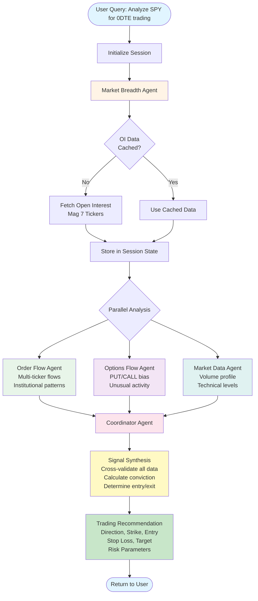

# trade-copilot-agent-swarm

Multi-agent system for 0DTE trading signal generation built using Strands Agents framework.

## Architecture

This system uses a **multi-agent swarm** architecture where specialized agents collaborate to produce high-confidence 0DTE trading recommendations:

- **Strands Agents**: Multi-agent orchestration framework with session state caching
- **MCP Servers**: Model Context Protocol for financial data tools (market data, open interest)
- **HTTP APIs**: Real-time order flow and options data
- **Session Caching**: OI breadth data fetched once, reused across all agents via `invocation_state`

## Multi-Agent Workflow



### Workflow Phases

**Phase 1: Market Breadth Analysis (~30s first call, instant on subsequent)**
- Market Breadth Agent runs first
- Fetches open interest data for Mag 7 mega-caps
- Stores in `invocation_state` for all agents to access
- Subsequent calls use cached data (valid for session)

**Phase 2: Parallel Specialist Analysis (~15s)**
Three specialist agents run in parallel, all reading from cached OI:
- **Order Flow Agent**: Multi-ticker equity flows, institutional patterns
- **Options Flow Agent**: Unusual activity, PUT/CALL bias, Greeks
- **Market Data Agent**: Volume profile, technical indicators, ORB, FVG

**Phase 3: Coordinator Synthesis (~10s)**
- Aggregates all specialist insights
- Cross-validates signals with OI breadth
- Checks trading memory for consistency
- Calculates conviction score
- Generates final recommendation

**Total Execution Time:**
- First call (with OI fetch): **55-60 seconds**
- Subsequent calls (OI cached): **25-30 seconds** ⚡

## Tools Available

### Financial Data Tools (via MCP)
- `financial_volume_profile_tool` - Volume Profile analysis (POC, VAH, VAL)
- `financial_technical_analysis_tool` - Technical indicators (SMA, RSI, MACD, ATR, VWAP)
- `financial_technical_zones_tool` - Support/resistance zones
- `financial_orb_analysis_tool` - Opening Range Breakout analysis
- `financial_fvg_analysis_tool` - Fair Value Gap detection

### Order Flow Tools (via HTTP)
- `equity_order_flow_tool` - Real-time equity order flow analysis
- `options_order_flow_tool` - Options flow with sweeps and blocks
- `options_monitoring_tool` - Configure strike-specific monitoring

## Setup

1. Install dependencies:
```bash
pip install -r requirements.txt
```

2. Ensure MCP market data server is installed:
```bash
# Should be accessible as: mcp-market-data-server
which mcp-market-data-server
```

3. Configure HTTP server URLs in `config/settings.py` (defaults to localhost)

## Project Structure

```
trade-copilot-agent-swarm/
├── tools/
│   ├── financial_tools.py      # MCP-based financial data tools
│   ├── order_flow_tools.py     # HTTP-based order flow tools
│   └── options_flow_tools.py   # HTTP-based options tools
├── config/
│   └── settings.py             # Configuration settings
├── requirements.txt
└── README.md
```

## Usage

```python
from tools.financial_tools import financial_volume_profile_tool
from tools.order_flow_tools import equity_order_flow_tool

# Use in your Strands agent
from strands import Agent

agent = Agent(
    tools=[
        financial_volume_profile_tool,
        equity_order_flow_tool,
        # ... add other tools
    ]
)
```