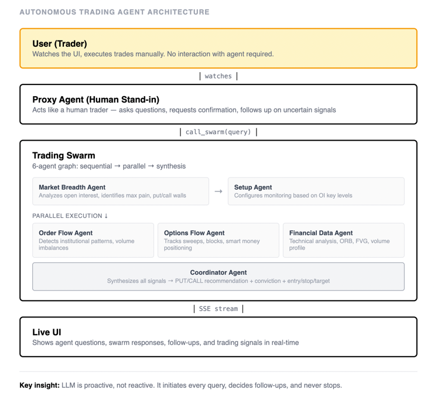

# Trade Copilot Agent Swarm


```
████████╗██████╗  █████╗ ██████╗ ███████╗     ██████╗ ██████╗ ██████╗ ██╗██╗      ██████╗ ████████╗
╚══██╔══╝██╔══██╗██╔══██╗██╔══██╗██╔════╝    ██╔════╝██╔═══██╗██╔══██╗██║██║     ██╔═══██╗╚══██╔══╝
   ██║   ██████╔╝███████║██║  ██║█████╗      ██║     ██║   ██║██████╔╝██║██║     ██║   ██║   ██║
   ██║   ██╔══██╗██╔══██║██║  ██║██╔══╝      ██║     ██║   ██║██╔═══╝ ██║██║     ██║   ██║   ██║
   ██║   ██║  ██║██║  ██║██████╔╝███████╗    ╚██████╗╚██████╔╝██║     ██║███████╗╚██████╔╝   ██║
   ╚═╝   ╚═╝  ╚═╝╚═╝  ╚═╝╚═════╝ ╚══════╝     ╚═════╝ ╚═════╝ ╚═╝     ╚═╝╚══════╝ ╚═════╝    ╚═╝
```

## Architecture



## Vision: Proactive LLMs

Most AI tools today are **reactive** — they wait for human input, respond, then wait again. This creates a bottleneck: the human becomes the limiting factor.

This system flips that model. The LLM is **proactive**:

- It initiates queries without being asked
- It decides what follow-up questions to ask
- It requests confirmation when signals are uncertain
- It never stops thinking

The Proxy Agent acts like a human trader would — constantly monitoring, questioning, verifying. But it does this 24/7 without fatigue.

> "When LLMs become proactive instead of reactive, it opens the door to truly autonomous systems. The agent doesn't assist the trader — it becomes the trader's always-on thinking partner."

The human's role shifts from **operator** to **observer**. They watch the agent's reasoning in real-time and only step in to execute trades.

## Stack

- **Strands Agents SDK** — Multi-agent orchestration
- **Strands Graph** — Sequential + parallel workflow
- **MCP Servers** — Financial data (market data, open interest)
- **Claude Haiku/Sonnet** — LLM reasoning

## Agents

| Agent | Role |
|-------|------|
| **Market Breadth** | Analyzes open interest, identifies max pain, put/call walls |
| **Setup** | Configures monitoring based on OI key levels |
| **Order Flow** | Detects institutional patterns, volume imbalances |
| **Options Flow** | Tracks sweeps, blocks, smart money positioning |
| **Financial Data** | Technical analysis, ORB, FVG, volume profile |
| **Coordinator** | Synthesizes signals → PUT/CALL + conviction + entry/stop/target |

## Zero-DTE Agent Workflow

The Zero-DTE Agent runs continuously, using two tools to query the swarm:

```
┌─────────────────────────────────────────────────────────────────────────────┐
│                           ZERO-DTE AGENT (Haiku)                            │
│                         Continuous Monitoring Loop                          │
└─────────────────────────────────────────────────────────────────────────────┘
                                      │
                    ┌─────────────────┴─────────────────┐
                    │                                   │
                    ▼                                   ▼
        ┌───────────────────┐               ┌───────────────────┐
        │   analyze_market  │               │    fast_follow    │
        │    (FULL MODE)    │               │    (FAST MODE)    │
        │                   │               │                   │
        │  • All 6 agents   │               │  • 2 agents only  │
        │  • 25-60 seconds  │               │  • 8-12 seconds   │
        │  • Fresh OI data  │               │  • Order Flow +   │
        │  • Complete view  │               │    Technical      │
        └─────────┬─────────┘               └─────────┬─────────┘
                  │                                   │
                  └─────────────────┬─────────────────┘
                                    │
                                    ▼
                    ┌───────────────────────────────┐
                    │         TRADING SWARM         │
                    │                               │
                    │  Market    Order    Options   │
                    │  Breadth   Flow     Flow      │
                    │     │        │        │       │
                    │     └────────┼────────┘       │
                    │              ▼                │
                    │  ┌─────────────────────┐      │
                    │  │    COORDINATOR      │      │
                    │  │  Signal + Conviction│      │
                    │  └─────────────────────┘      │
                    └───────────────┬───────────────┘
                                    │
                                    ▼
                    ┌───────────────────────────────┐
                    │     Response + Signal JSON    │
                    │  {"direction":"PUT",          │
                    │   "conviction":"HIGH"}        │
                    └───────────────┬───────────────┘
                                    │
                    ┌───────────────┴───────────────┐
                    │                               │
                    ▼                               ▼
            ┌─────────────┐                 ┌─────────────┐
            │   Console   │                 │  Live UI    │
            │   Output    │                 │  (SSE)      │
            └─────────────┘                 └─────────────┘
```

### Tool Selection Logic

```
┌──────────────────────────────────────────────────────────────────┐
│                     WHEN TO USE EACH TOOL                        │
├──────────────────────────────────────────────────────────────────┤
│                                                                  │
│  analyze_market (FULL)          fast_follow (FAST)               │
│  ─────────────────────          ──────────────────               │
│  • Initial analysis             • Validation checks              │
│  • Signal flipped (PUT↔CALL)    • Entry/price updates            │
│  • Conviction dropped           • Momentum monitoring            │
│  • Every 4-5 fast_follows       • Risk checks                    │
│                                                                  │
└──────────────────────────────────────────────────────────────────┘

                         Decision Flow
                         ─────────────

              ┌─────────────────────────────────┐
              │  Read response, extract signal  │
              │  SIGNAL: PUT/CALL/WAIT          │
              │  CONVICTION: HIGH/MED/LOW       │
              └───────────────┬─────────────────┘
                              │
                              ▼
                    ┌─────────────────┐
                    │ Signal changed? │
                    │ PUT↔CALL flip?  │
                    └────────┬────────┘
                             │
                ┌────────────┴────────────┐
                │ YES                     │ NO
                ▼                         ▼
        ┌───────────────┐       ┌─────────────────┐
        │analyze_market │       │Conviction drop? │
        │  to confirm   │       │ HIGH→MED/LOW?   │
        └───────────────┘       └────────┬────────┘
                                         │
                            ┌────────────┴────────────┐
                            │ YES                     │ NO
                            ▼                         ▼
                    ┌───────────────┐       ┌─────────────────┐
                    │analyze_market │       │ 4-5 fast_follows│
                    │  to confirm   │       │   completed?    │
                    └───────────────┘       └────────┬────────┘
                                                     │
                                        ┌────────────┴────────────┐
                                        │ YES                     │ NO
                                        ▼                         ▼
                                ┌───────────────┐       ┌───────────────┐
                                │analyze_market │       │  fast_follow  │
                                │   periodic    │       │   continue    │
                                │   refresh     │       │  monitoring   │
                                └───────────────┘       └───────────────┘
```
`
